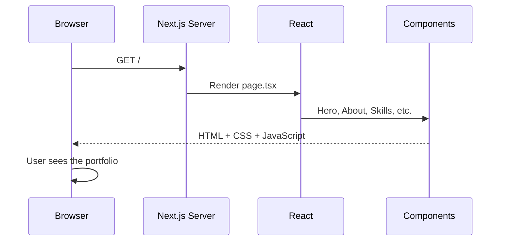
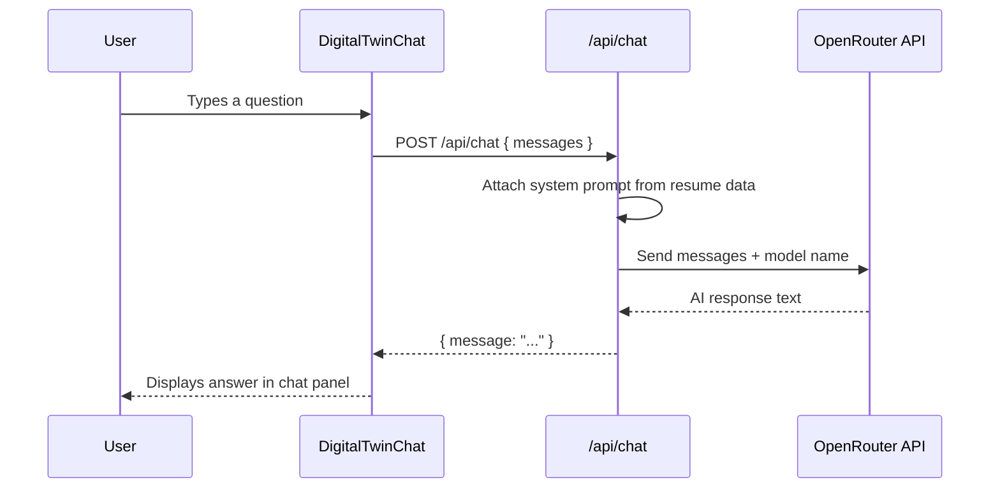

# Building a Professional Portfolio with Next.js and an AI Digital Twin

A beginner-friendly walkthrough of this project: a personal portfolio website with a chatbot that answers questions about your career.

---

## Table of Contents

1. [What We Built](#what-we-built)
2. [Technology Summary](#technology-summary)
3. [Prerequisites and Setup](#prerequisites-and-setup)
4. [Project Structure](#project-structure)
5. [High-Level Walkthrough](#high-level-walkthrough)
6. [Detailed Code Review](#detailed-code-review)
7. [How the Digital Twin Works](#how-the-digital-twin-works)
8. [Running the Project](#running-the-project)
9. [Five Ways to Improve This Code](#five-ways-to-improve-this-code)

---

## What We Built

This project is a **single-page portfolio website** for Muhammad Ahmed Abdelhadi, an Angular developer. It includes:

- A **Hero** section with name, tagline, and call-to-action buttons
- **About Me**, **Career Journey**, **Skills**, **Portfolio**, and **Contact** sections
- A dark, modern design ("enterprise meets edgy") with animations
- A floating **Digital Twin** chat widget powered by AI (via OpenRouter)
- A downloadable CV (PDF in the `public/` folder)

Everything runs locally at `http://localhost:3000`.

---

## Technology Summary

If you are new to frontend development, here is what each technology does and why we chose it.

### HTML, CSS, and JavaScript (the foundations)

Every website is built on three core web technologies:

| Technology | Role |
|---|---|
| **HTML** | Structure — headings, paragraphs, buttons, links |
| **CSS** | Style — colors, fonts, spacing, animations |
| **JavaScript** | Behavior — clicks, form input, fetching data |

Modern frontend frameworks **generate** HTML, CSS, and JavaScript for you. You rarely write raw HTML files by hand anymore.

### React

**React** is a JavaScript library for building user interfaces. Its main idea is **components**: reusable pieces of UI.

Instead of one giant HTML file, you split the page into small parts:

```
Navigation  →  top menu bar
Hero        →  big intro section
About       →  biography text
Footer      →  bottom links
```

Each component is a function that returns HTML-like syntax called **JSX**:

```jsx
export function Hero() {
  return (
    <section>
      <h1>Muhammad Ahmed Abdelhadi</h1>
      <p>Angular Developer</p>
    </section>
  );
}
```

React also manages **state** — data that changes over time (e.g. whether the chat panel is open or closed).

### Next.js

**Next.js** is a framework built on top of React. It adds:

- **File-based routing** — a file at `src/app/page.tsx` automatically becomes the homepage
- **Server-side API routes** — backend endpoints in the same project (e.g. `/api/chat`)
- **Optimized builds** — fast loading, SEO-friendly pages
- **Built-in font loading** — Google Fonts without extra setup

Think of React as the engine and Next.js as the full car with steering, brakes, and GPS.

### TypeScript

**TypeScript** is JavaScript with **types**. Types describe what shape your data should have:

```typescript
type Message = {
  role: "user" | "assistant";
  content: string;
};
```

This catches mistakes before you run the code. For example, TypeScript would warn you if you tried to set `role` to `"admin"` because only `"user"` and `"assistant"` are allowed.

### Tailwind CSS

**Tailwind** is a CSS framework where you style elements using **utility classes** directly in your JSX:

```jsx
<button className="rounded-lg bg-accent px-7 py-3 text-sm font-semibold">
  Click Me
</button>
```

Instead of writing a separate CSS file with `.my-button { ... }`, you compose styles with small class names like `rounded-lg` (rounded corners) and `bg-accent` (background color).

This project uses **Tailwind CSS v4**, which defines custom colors in `globals.css` using CSS variables.

### OpenRouter

**OpenRouter** is a service that gives you access to many AI models through one API. Our Digital Twin sends chat messages to OpenRouter, which forwards them to the model `openai/gpt-oss-120b:free` and returns a response.

The API key lives in a `.env` file on the server — it is **never** exposed to the browser.

---

## Prerequisites and Setup

Before running this project, you need:

1. **Node.js** (v18 or later) — [https://nodejs.org](https://nodejs.org)
2. **npm** — comes with Node.js; installs packages
3. An **OpenRouter API key** — stored in `.env` at the project root:

```env
OPENROUTER_API_KEY=your-key-here
```

Install dependencies and start the dev server:

```bash
npm install
npm run dev
```

Open [http://localhost:3000](http://localhost:3000) in your browser.

---

## Project Structure

```
site/
├── public/                          # Static files served as-is
│   └── Muhammad-Abdelhadi-CV.pdf      # Downloadable resume
├── src/
│   ├── app/                         # Next.js App Router
│   │   ├── api/chat/route.ts        # Backend API for AI chat
│   │   ├── globals.css              # Global styles + Tailwind theme
│   │   ├── layout.tsx               # Root HTML shell (fonts, metadata)
│   │   ├── page.tsx                 # Homepage — assembles all sections
│   │   └── icon.tsx                 # Favicon generator
│   ├── components/                  # Reusable UI pieces
│   │   ├── Navigation.tsx
│   │   ├── Hero.tsx
│   │   ├── About.tsx
│   │   ├── CareerJourney.tsx
│   │   ├── Skills.tsx
│   │   ├── Portfolio.tsx
│   │   ├── Contact.tsx
│   │   ├── Footer.tsx
│   │   ├── ScrollReveal.tsx
│   │   └── DigitalTwinChat.tsx      # AI chat widget
│   ├── data/
│   │   └── resume.ts                # All portfolio content in one place
│   └── lib/
│       └── digital-twin-context.ts  # Builds the AI system prompt
├── .env                             # Secret API key (not committed to git)
├── package.json                     # Project dependencies and scripts
└── tutorial.md                      # This file
```

**Key idea:** content lives in `data/`, UI lives in `components/`, and the page in `app/page.tsx` wires everything together.

---

## High-Level Walkthrough

### How a page visit works

When you open `http://localhost:3000`, this happens:



1. The browser requests the homepage.
2. Next.js runs `page.tsx` on the server.
3. React renders each component into HTML.
4. The browser receives the page and hydrates it (makes buttons and animations interactive).

### How the Digital Twin chat works



The API key stays on the server. The browser never sees it.

### Design philosophy

The site follows three principles:

1. **Separation of content and presentation** — resume text is in `resume.ts`; components only display it.
2. **Component composition** — small, focused files instead of one massive page.
3. **Server/client split** — static sections render on the server; interactive parts (navigation menu, chat) use `"use client"`.

---

## Detailed Code Review

This section walks through the most important files with explanations and code samples.

---

### 1. Content layer — `src/data/resume.ts`

All portfolio text is stored in one file. This makes updates easy: change your job title once, and every section reflects it.

```typescript
export const profile = {
  name: "Muhammad Ahmed Abdelhadi",
  title: "Angular Developer",
  tagline: "Building precision front-end systems for healthcare & enterprise.",
  location: "Maadi, Cairo, Egypt",
  email: "muhabdhadi@gmail.com",
  phone: "+20 102 120 0083",
  links: {
    github: "https://github.com/Muhabdhadi",
    leetcode: "https://leetcode.com/Muhabdhadi",
  },
};
```

**Why this matters for beginners:**

- `export const` means other files can import this data with `import { profile } from "@/data/resume"`.
- The `@/` prefix is a shortcut defined in `tsconfig.json` — it points to the `src/` folder.
- Arrays like `experience[]` hold structured job history that components loop over with `.map()`.

Example of looping over experience in a component:

```tsx
{experience.map((job) => (
  <article key={`${job.company}-${job.period}`}>
    <h3>{job.role}</h3>
    <p>{job.company} · {job.period}</p>
  </article>
))}
```

The `key` prop helps React track which list item is which when the list changes.

---

### 2. Root layout — `src/app/layout.tsx`

Every page in the app is wrapped by `layout.tsx`. It sets up fonts, metadata, and the outer HTML structure.

```tsx
import type { Metadata } from "next";
import { DM_Sans, Syne } from "next/font/google";
import "./globals.css";

const syne = Syne({
  subsets: ["latin"],
  variable: "--font-syne",
  display: "swap",
});

export const metadata: Metadata = {
  title: "Muhammad Ahmed Abdelhadi | Angular Developer",
  description: "Professional portfolio of Muhammad Ahmed Abdelhadi...",
};

export default function RootLayout({ children }: { children: React.ReactNode }) {
  return (
    <html lang="en" className={`${syne.variable} ${dmSans.variable}`}>
      <body className="antialiased">{children}</body>
    </html>
  );
}
```

**Key concepts:**

- **`metadata`** — sets the browser tab title and what search engines see.
- **`children`** — whatever page is being rendered (in our case, `page.tsx` content).
- **Google Fonts via `next/font`** — fonts are downloaded at build time, so there is no flash of unstyled text.

---

### 3. Homepage assembly — `src/app/page.tsx`

The homepage is a simple list of components. No logic here — just composition:

```tsx
import { About } from "@/components/About";
import { DigitalTwinChat } from "@/components/DigitalTwinChat";
import { Hero } from "@/components/Hero";
// ... other imports

export default function Home() {
  return (
    <>
      <Navigation />
      <main>
        <Hero />
        <ScrollReveal>
          <About />
        </ScrollReveal>
        <ScrollReveal delay={100}>
          <CareerJourney />
        </ScrollReveal>
        {/* ... more sections */}
      </main>
      <Footer />
      <DigitalTwinChat />
    </>
  );
}
```

**Key concepts:**

- `<>` and `</>` are **React fragments** — they group elements without adding an extra HTML `<div>`.
- `ScrollReveal` wraps sections to animate them when they scroll into view.
- `DigitalTwinChat` sits outside `<main>` because it is a fixed floating widget, not part of the page flow.

---

### 4. A presentational component — `src/components/Hero.tsx`

Hero is a **server component** (no `"use client"` directive). It reads data and renders HTML — no interactivity needed.

```tsx
import { profile } from "@/data/resume";

export function Hero() {
  return (
    <section className="relative flex min-h-screen items-center overflow-hidden pt-20">
      {/* Decorative background grid */}
      <div className="pointer-events-none absolute inset-0 grid-bg opacity-40" />

      <div className="relative mx-auto w-full max-w-6xl px-6 lg:px-8">
        <h1 className="font-display text-5xl font-bold sm:text-6xl lg:text-7xl">
          <span className="block text-frost">
            {profile.name.split(" ").slice(0, 2).join(" ")}
          </span>
          <span className="gradient-text block">
            {profile.name.split(" ").slice(2).join(" ")}
          </span>
        </h1>

        <p className="mt-8 text-lg text-muted sm:text-xl">
          {profile.tagline}
        </p>

        <a href="#journey" className="rounded-lg bg-accent px-7 py-3.5 text-sm font-semibold text-ink">
          View My Journey
        </a>
      </div>
    </section>
  );
}
```

**Tailwind classes explained:**

| Class | Meaning |
|---|---|
| `min-h-screen` | Minimum height = full viewport |
| `max-w-6xl` | Maximum width cap for readability |
| `px-6 lg:px-8` | Horizontal padding; more on large screens |
| `sm:text-6xl` | Larger text on small screens and up |
| `bg-accent` | Background uses our custom cyan accent color |

**JavaScript string methods used:**

- `profile.name.split(" ")` — splits the name into words: `["Muhammad", "Ahmed", "Abdelhadi"]`
- `.slice(0, 2).join(" ")` — takes the first two words and joins them: `"Muhammad Ahmed"`

---

### 5. Scroll animations — `src/components/ScrollReveal.tsx`

This component uses the browser's **Intersection Observer API** to detect when an element enters the viewport, then fades it in.

```tsx
"use client";

import { useEffect, useRef, useState } from "react";

export function ScrollReveal({ children, delay = 0 }) {
  const ref = useRef<HTMLDivElement>(null);
  const [visible, setVisible] = useState(false);

  useEffect(() => {
    const el = ref.current;
    if (!el) return;

    const observer = new IntersectionObserver(
      ([entry]) => {
        if (entry.isIntersecting) {
          setVisible(true);
          observer.unobserve(el);
        }
      },
      { threshold: 0.12 }
    );

    observer.observe(el);
    return () => observer.disconnect();
  }, []);

  return (
    <div
      ref={ref}
      className={`transition-all duration-700 ${
        visible ? "translate-y-0 opacity-100" : "translate-y-8 opacity-0"
      }`}
      style={{ transitionDelay: `${delay}ms` }}
    >
      {children}
    </div>
  );
}
```

**Why `"use client"` is required:**

Next.js server components cannot use browser APIs (`IntersectionObserver`) or React hooks (`useState`, `useEffect`). Adding `"use client"` at the top tells Next.js: "this component runs in the browser."

**React hooks explained:**

| Hook | Purpose |
|---|---|
| `useState(false)` | Stores whether the element is visible; starts as `false` |
| `useRef(null)` | Holds a reference to the DOM element |
| `useEffect(...)` | Runs code after the component mounts (sets up the observer) |

---

### 6. Global styling — `src/app/globals.css`

Tailwind v4 uses a `@theme` block to define custom design tokens:

```css
@import "tailwindcss";

@theme inline {
  --color-ink: #06060b;           /* Near-black background */
  --color-surface: #0e0e16;       /* Card backgrounds */
  --color-accent: #00e5ff;        /* Electric cyan highlight */
  --color-violet: #8b5cf6;        /* Purple accent */
  --color-frost: #e8e8f0;         /* Primary text color */
  --color-muted: #8b8ba3;         /* Secondary text color */
  --font-display: var(--font-syne);
  --font-body: var(--font-dm-sans);
}
```

Custom utility classes extend Tailwind:

```css
.gradient-text {
  background: linear-gradient(135deg, var(--color-frost), var(--color-accent), var(--color-violet));
  -webkit-background-clip: text;
  background-clip: text;
  color: transparent;
}

.edge-border::before {
  /* Creates a gradient border effect on cards */
  content: "";
  position: absolute;
  inset: 0;
  padding: 1px;
  border-radius: inherit;
  background: linear-gradient(135deg, rgba(0,229,255,0.6), transparent, rgba(139,92,246,0.4));
  mask: linear-gradient(#fff 0 0) content-box, linear-gradient(#fff 0 0);
  mask-composite: exclude;
}
```

Once defined, you use them like any Tailwind class: `className="gradient-text"` or `className="edge-border"`.

---

### 7. AI system prompt — `src/lib/digital-twin-context.ts`

Before sending a question to the AI, we build a **system prompt** — instructions that tell the model who it is and what it knows.

```typescript
import { about, education, experience, profile, skillGroups } from "@/data/resume";

export function buildDigitalTwinSystemPrompt(): string {
  const careerHistory = experience
    .map(
      (job) =>
        `- ${job.role} at ${job.company} (${job.period})
  Highlights: ${job.highlights.join("; ")}
  Skills used: ${job.skills.join(", ")}`
    )
    .join("\n");

  return `You are the Digital Twin of ${profile.name}...
  
CAREER HISTORY:
${careerHistory}

RULES:
- Only answer questions about Muhammad's career, skills, education, and experience.
- Do not invent employers or credentials not listed above.`;
}
```

**Why a system prompt?**

Without it, the AI would give generic answers. With it, the AI knows your exact job history and speaks in first person as you. The prompt is rebuilt from `resume.ts` on every request, so updating your resume automatically updates the AI's knowledge.

---

### 8. Chat API route — `src/app/api/chat/route.ts`

This is a **server-side endpoint**. It runs on Node.js, not in the browser.

```typescript
import { buildDigitalTwinSystemPrompt } from "@/lib/digital-twin-context";
import { NextRequest, NextResponse } from "next/server";

const MODEL = "openai/gpt-oss-120b:free";

export async function POST(request: NextRequest) {
  const apiKey = process.env.OPENROUTER_API_KEY;

  if (!apiKey) {
    return NextResponse.json({ error: "OpenRouter API key is not configured." }, { status: 500 });
  }

  const { messages } = await request.json();

  const response = await fetch("https://openrouter.ai/api/v1/chat/completions", {
    method: "POST",
    headers: {
      Authorization: `Bearer ${apiKey}`,
      "Content-Type": "application/json",
      "X-Title": "Muhammad Abdelhadi - Digital Twin",
    },
    body: JSON.stringify({
      model: MODEL,
      messages: [
        { role: "system", content: buildDigitalTwinSystemPrompt() },
        ...messages,
      ],
    }),
  });

  const data = await response.json();
  const content = data.choices?.[0]?.message?.content;

  return NextResponse.json({ message: content });
}
```

**Security notes for beginners:**

- `process.env.OPENROUTER_API_KEY` reads from `.env` on the **server only**.
- Files in `src/app/api/` never ship to the browser — the key stays secret.
- The route validates incoming messages and limits history to the last 20 messages.

**HTTP status codes used:**

| Code | Meaning |
|---|---|
| `400` | Bad request — missing or invalid messages |
| `500` | Server error — API key missing or unexpected crash |
| `502` | Bad gateway — OpenRouter returned an error |

---

### 9. Chat UI — `src/components/DigitalTwinChat.tsx`

The chat widget is a **client component** with several pieces of state:

```tsx
"use client";

export function DigitalTwinChat() {
  const [open, setOpen] = useState(false);       // Is the panel visible?
  const [messages, setMessages] = useState([...]); // Chat history
  const [input, setInput] = useState("");         // Current typed text
  const [loading, setLoading] = useState(false);  // Waiting for AI?
  const [error, setError] = useState(null);       // Error message if any

  async function sendMessage(text: string) {
    const userMessage = { role: "user", content: text.trim() };
    setMessages((prev) => [...prev, userMessage]);
    setLoading(true);

    const response = await fetch("/api/chat", {
      method: "POST",
      headers: { "Content-Type": "application/json" },
      body: JSON.stringify({ messages: [...existingMessages, userMessage] }),
    });

    const data = await response.json();
    setMessages((prev) => [...prev, { role: "assistant", content: data.message }]);
    setLoading(false);
  }
}
```

**The send flow step by step:**

1. User types a question and presses Enter.
2. `sendMessage` adds the user message to the local `messages` array immediately (optimistic UI).
3. A `fetch` POST goes to `/api/chat` with the conversation history.
4. The server calls OpenRouter and returns the AI reply.
5. The reply is appended to `messages` and rendered in the chat panel.

**UI patterns used:**

- **Floating action button** — fixed to bottom-right, toggles the panel open/closed.
- **Suggested prompts** — quick-start buttons shown before the first user message.
- **Loading dots** — animated indicator while waiting for the AI.
- **Auto-scroll** — `useRef` + `scrollIntoView` keeps the latest message visible.

---

## How the Digital Twin Works

Here is the complete picture in plain English:

1. **Knowledge source:** Your resume data in `src/data/resume.ts`.
2. **Prompt builder:** `buildDigitalTwinSystemPrompt()` converts that data into instructions for the AI.
3. **API route:** `/api/chat` receives questions, attaches the system prompt, and calls OpenRouter.
4. **Chat widget:** `DigitalTwinChat.tsx` provides the UI and talks to `/api/chat`.

When you update `resume.ts` (new job, new skill), the Digital Twin automatically knows about it — no separate AI training required.

---

## Running the Project

| Command | What it does |
|---|---|
| `npm run dev` | Starts development server at `http://localhost:3000` |
| `npm run build` | Creates an optimized production build |
| `npm run start` | Serves the production build |
| `npm run lint` | Checks code for common errors |

**Important:** Stop the dev server before running `npm run build`. Running both at the same time can corrupt the `.next` cache and cause errors like `Cannot find module './331.js'`. If that happens:

```bash
# Stop the dev server, then:
Remove-Item -Recurse -Force .next   # Windows PowerShell
npm run dev
```

---

## Five Ways to Improve This Code

After reviewing the project, here are five meaningful improvements — ordered from highest impact to nice-to-have.

### 1. Add streaming responses for the Digital Twin

**Current behavior:** The chat waits for the full AI response before displaying anything. On slow connections, users stare at loading dots for several seconds.

**Improvement:** Use OpenRouter's streaming API (`stream: true`) and display the response word-by-word as it arrives — like ChatGPT does. Next.js supports streaming via `ReadableStream` in API routes.

**Why it matters:** Streaming dramatically improves perceived speed and user experience.

---

### 2. Add rate limiting and input sanitization to the chat API

**Current behavior:** The `/api/chat` route accepts any number of requests with no throttling. A malicious user could spam the endpoint and burn through your OpenRouter credits.

**Improvement:** Add rate limiting (e.g. 10 requests per minute per IP) using a library like `@upstash/ratelimit`, and enforce a maximum message length (e.g. 500 characters).

**Why it matters:** Protects your API key and prevents abuse in production.

---

### 3. Render AI responses as Markdown

**Current behavior:** AI replies are displayed as plain text inside `{msg.content}`. The model often returns markdown formatting (`**bold**`, bullet lists) which shows up as raw characters.

**Improvement:** Use a library like `react-markdown` to render formatted text, links, and lists properly in chat bubbles.

**Why it matters:** Responses with job highlights and skill lists would look much cleaner and more readable.

---

### 4. Extract shared design tokens into a dedicated theme file

**Current behavior:** Colors, fonts, and custom CSS classes are defined in `globals.css`, while Tailwind utility classes are scattered across every component. There is no single source of truth for spacing or typography scales.

**Improvement:** Create a `src/styles/theme.ts` or expand the `@theme` block with consistent spacing, font sizes, and shadow tokens. Consider a small set of reusable component classes (e.g. `.btn-primary`, `.card`) to reduce repeated Tailwind strings.

**Why it matters:** Makes the design system easier to maintain and update consistently across all sections.

---

### 5. Add unit and integration tests

**Current behavior:** There are no automated tests. Changes to `resume.ts`, the API route, or chat logic are verified manually by opening the browser.

**Improvement:** Add tests with **Vitest** (unit tests for `buildDigitalTwinSystemPrompt` and message validation) and **Playwright** (end-to-end test: open site, click Digital Twin, send a message, verify a response appears).

**Why it matters:** Tests catch regressions early — especially important before deploying to production or pushing resume updates.

---

## Summary

You now have a modern portfolio built with:

- **Next.js 15** for routing, server rendering, and API routes
- **React 19** for component-based UI
- **TypeScript** for type safety
- **Tailwind CSS v4** for styling
- **OpenRouter** for AI-powered career chat

The architecture separates **content** (`data/`), **presentation** (`components/`), **page structure** (`app/page.tsx`), and **backend logic** (`app/api/`). That separation makes the site easy to update, extend, and eventually deploy to platforms like Vercel or Netlify.

Happy coding!
